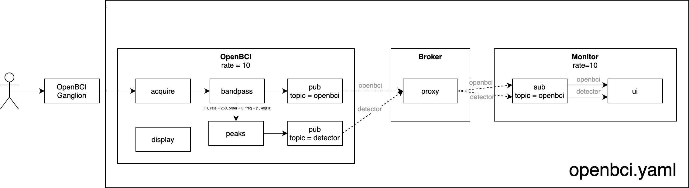

# EEGApi
EEG Api uses Timeflux to get data from the openBCI Ganglion board using Bluetooth connection.

## Timeflux
In timeflux/openbci.yaml file you will find the timeflux structure definition.

## Timeflux diagram representation




Using timeflux.helpers.viz you can have a visual representation of the graph. Reference here: https://doc.timeflux.io/en/stable/api/timeflux/helpers/viz/index.html

To use it, first install graphviz. More info: https://graphviz.gitlab.io/download/
For macOS:
```
brew install graphviz

```

then run:
``` 
cd timeflux 
python -m timeflux.helpers.viz openbci.yaml

```
